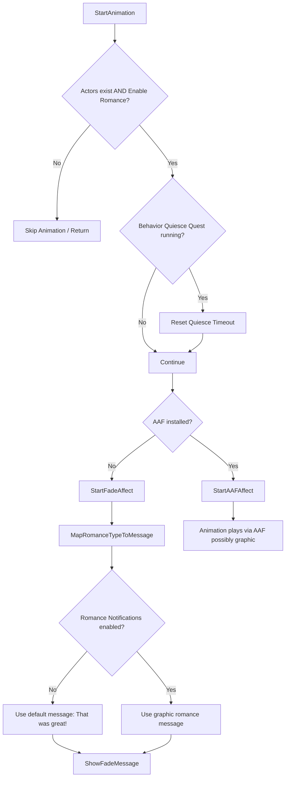

# Sexual Content Compliance in Assimilation Mod

## Overview

Assimilation has been designed with careful consideration to comply with platform guidelines regarding sexually-explicit material. The mod provides players with a **full choice** between experiencing graphic romance content or safe, non-explicit text messages. This ensures that public demos, videos, and streams can be shared without violating age or content restrictions.

### Features Supporting Compliance

- **AAF Optional:** Advanced Animation Framework (AAF) is optional. If not installed, animations that might depict sexual acts are replaced by a **fade-to-black with popup messages**.
- **Enable Romance Flag:** Players can toggle this boolean setting:
  - **True:** Romance interactions are enabled.
  - **False:** Romance interactions are disabled.
- **Romance Notifications Flag:** Players can toggle this boolean setting:
  - **True:** Displays graphic descriptions of romance interactions.
  - **False:** Displays a neutral, safe message "That was great!" instead of graphic content.
- **Fade-to-Black Messaging:** Even when AAF is not installed, interactions are shown via text with a fade effect, maintaining immersion without explicit visuals.

## Flowchart

## Explanation of Compliance Measures

1. **Non-Graphic Default Path:**
    - When `Romance Notifications` is set to `false` and AAF is not installed, all romance interactions use the **safe fallback message**. 
    - This ensures that even without graphics, the user receives meaningful feedback without displaying any sexually explicit content.

2. **Optional Graphic Descriptions:**
    - Players who choose to enable graphic descriptions can see the detailed messages, but this path is **100% optional**.

3. **Demo and Public Use:**
    - For creating demo videos or public streams, **disable AAF** and set `Romance Notifications = false`. 
    - All text shown will be neutral, making the mod **fully compliant** with YouTube, Discord, NexusMods, and similar platforms.

4. **Maintainable System:**
    - All decisions about message content and animation paths are centralized in `ASS_Message.MapRomanceTypeToMessage` and `StartAnimation`.
    - This modular approach allows easy updates to compliance rules or content display without changing core game mechanics.

## Summary

Assimilation prioritizes user choice and platform compliance. By providing:
- optional graphic content,
- safe fallback messages,
- and a clear, modular system,

the mod ensures that both private adult players and public-facing demos are supported without risk of violating content guidelines.
